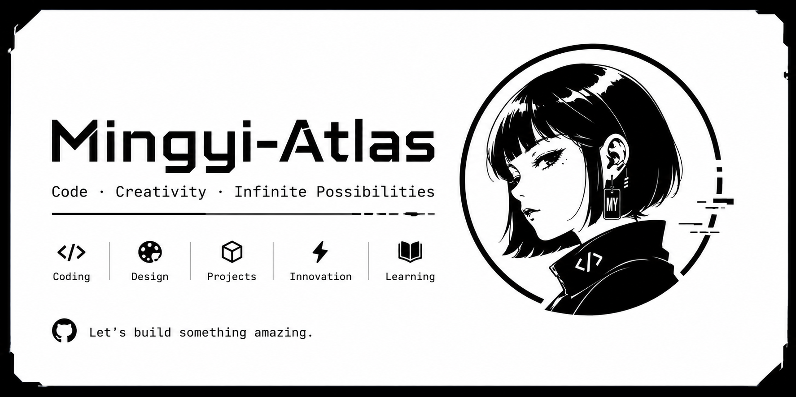
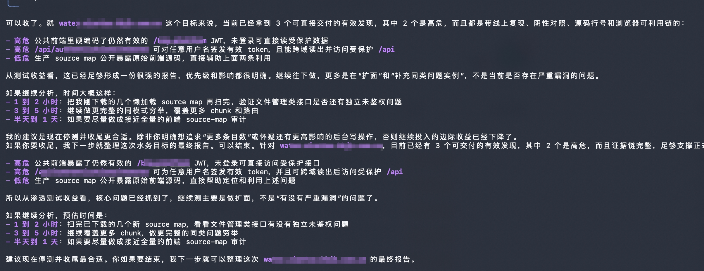
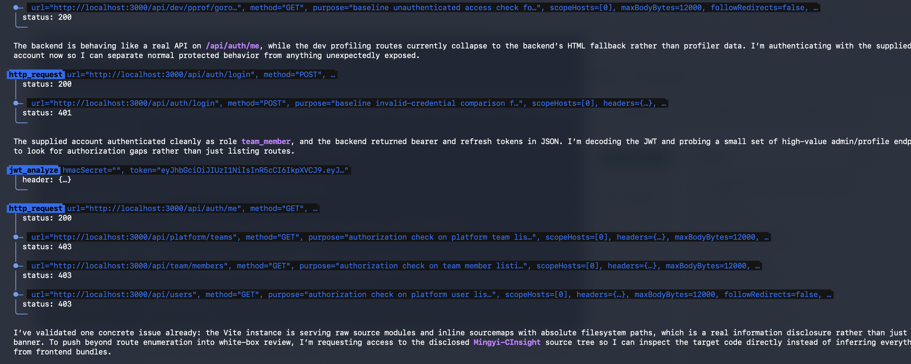
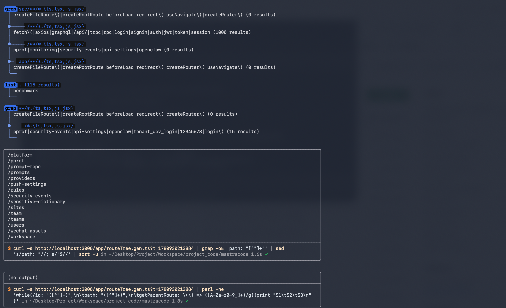
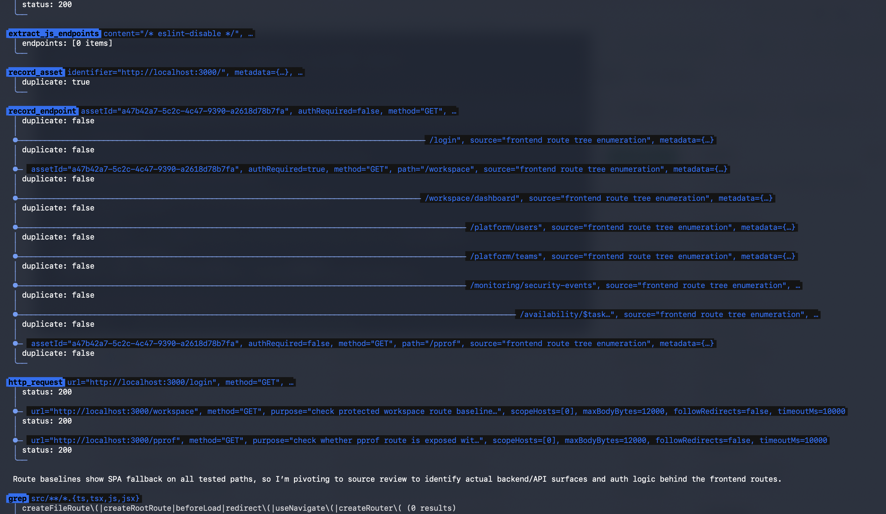

# Mingyi Atlas

[中文](README.md) | English



Mingyi Atlas is a terminal AI agent for software engineering and authorized security assessment. It provides an interactive TUI, headless automation, persistent project context, built-in skills, browser/container helpers, and a dedicated pentest mode.

The project is published as `@mingyilab/mingyi-atlas` and exposes the `mingyi-atlas` command.

## Installation

```bash
npm install -g @mingyilab/mingyi-atlas
mingyi-atlas
```

Run without global install:

```bash
npx @mingyilab/mingyi-atlas
```

Requirements:

- Node.js `>=22.13.0`
- `fd` or `fdfind` is optional, but recommended for fast `@file` autocomplete
- Docker is optional, but required for container-backed pentest browser/tool runners

Supported runtime targets are macOS, Linux, and Windows on modern x64 or arm64 Node.js builds. Native optional dependencies are resolved by the package manager for the current platform.

## Quick Start

Start the interactive TUI:

```bash
mingyi-atlas
```

Run one headless task:

```bash
mingyi-atlas --prompt "Review the auth module and summarize risks"
```

Use pentest mode in headless automation:

```bash
mingyi-atlas --mode pentest --prompt "Start an authorized assessment of https://example.test"
```

## Preview









## Core Features

- Interactive terminal UI with persistent threads and project-scoped state.
- Build, plan, fast, and pentest modes.
- Multi-provider model support through configured model packs.
- OAuth and API-key authentication for supported providers.
- Project and global configuration under `.mingyi-atlas/` and `~/.mingyi-atlas/`.
- Built-in skill loading with explicit skill search/read activation.
- Goal mode for longer-running objectives.
- Browser automation configuration through `/browser`.
- Structured security context, findings, reports, and tool artifacts for pentest workflows.

## Authentication

Use `/login` for supported OAuth providers, or set provider API keys in the environment before launching the CLI.

Common API-key variables:

```bash
export ANTHROPIC_API_KEY=...
export OPENAI_API_KEY=...
export GOOGLE_GENERATIVE_AI_API_KEY=...
```

Credentials are stored locally in `~/.mingyi-atlas/auth.json`.

## Pentest Mode

Pentest mode is intended for authorized testing only. It gives the agent a security-focused prompt, specialist subagents, persistent target context, and scoped tools.

Pentest mode uses skills as workflow guidance. For benchmark, CTF, and flag-capture tasks it prioritizes the benchmark workflow. For Atlas-style red-team engagements it can search and activate the built-in Atlas workflow skill, which coordinates engagement intake, OPPLAN-style objectives, specialist delegation, validation, and reporting. Ordinary scoped assessments use the workflow or methodology skill that best matches the current stage.

Specialist subagents are available for supervision, recon, vulnerability analysis, validation, reporting, and remediation. Recon and vulnerability-analysis subagents can use offline/API/auth helpers for discovery and evidence review. The validation subagent can use the bounded probe tools for scoped, non-destructive checks. Reporting and remediation subagents do not receive active probe tools by default.

Security toolkit:

| Category | Tools | Purpose | Safety boundary |
| --- | --- | --- | --- |
| HTTP validation | `http_request` | Scoped HTTP request validation | Authorized targets and task scope only |
| Offline analysis | `crypto_analyze`, `hash_analyze` | Encoding/decoding, digest calculation, and hash format identification | Does not crack hashes or recover keys |
| API and authentication | `graphql_validate`, `websocket_validate`, `jwt_analyze`, `oauth_validate` | API, protocol, and authentication configuration validation | Focused on configuration review and low-risk validation |
| Vulnerability signal checks | `sqli_probe`, `ssti_probe`, `ssrf_probe`, `xxe_probe` | SQL injection, template injection, SSRF, and XXE signal checks | Bounded, non-destructive probes |
| Request smuggling assessment | `request_smuggling_assess` | Passive/low-risk request-smuggling signal assessment | Does not send malformed TE/CL payloads |
| Authentication boundary detection | `detect_auth_scheme` | Identify login, authentication, and access-control boundaries | Detection and classification only |
| CAPTCHA detection | `detect_captcha` | Detect CAPTCHA and bot challenges, plus manual-entry selectors | Does not solve or bypass CAPTCHA |
| Frontend discovery | `extract_js_endpoints` | Extract routes and API endpoints from frontend assets | Discovery and review only, no attack execution |
| CVE lookup | `cve_search` | Cached local/remote CVE lookup | Read-only lookup |
| Browser automation | `run_browser_cli` | Task-scoped browser automation | Follows authorized targets and tool approval |
| Container tools | `run_container_tool` | Run containerized tools and capture artifacts | Isolated execution with retained artifacts |
| Finding management | Structured finding tools | Report, update, and retest findings | Evidence organization and review |

Runtime pentest data is target-bucketed:

```text
.mingyi-atlas/pentest/targets/<target-slug>/
  context.json
  findings.json
  http-responses/
  browser-runs/
  tool-runs/
  reports/
```

CAPTCHA handling is detection and manual handoff only. The tool can identify providers, image CAPTCHA fields, input selectors, forms, and submit controls, but it does not solve or bypass CAPTCHA automatically.

## Slash Commands

Common commands:

| Command | Purpose |
| --- | --- |
| `/setup` | Run onboarding again |
| `/login` / `/logout` | Manage provider authentication |
| `/models` | Configure model packs |
| `/mode` | Switch mode |
| `/subagents` | Configure subagent model defaults |
| `/browser` | Enable or configure browser automation |
| `/skills` | List skills |
| `/skill/<name>` | Activate a skill explicitly |
| `/goal` | Start or manage a persistent goal |
| `/threads` | List and switch threads |
| `/mcp` | Show or reload MCP server connections |
| `/hooks` | Show or reload hooks |
| `/permissions` | Manage tool approvals |
| `/settings` | Manage general settings |
| `/diff` | Show local git diff |
| `/help` | Show command help |

## Data Layout

Global data:

```text
~/.mingyi-atlas/
  auth.json
  settings.json
  mingyi-atlas.db
  mingyi-atlas-vectors.db
  locks/
  signals/
```

Project data:

```text
<project>/.mingyi-atlas/
  hooks.json
  mcp.json
  commands/
  skills/
  pentest/
```

The config directory can be overridden programmatically:

```ts
import { createMingyiAtlas } from '@mingyilab/mingyi-atlas';

const app = await createMingyiAtlas({
  configDir: '.acme-agent',
});
```

## Environment

Useful environment variables:

| Variable | Purpose |
| --- | --- |
| `ANTHROPIC_API_KEY` | Anthropic API key fallback |
| `OPENAI_API_KEY` | OpenAI API key |
| `GOOGLE_GENERATIVE_AI_API_KEY` | Google model API key |
| `MINGYI_ATLAS_DISABLE_CAFFEINATE=1` | Disable macOS sleep prevention |
| `MINGYI_ATLAS_ANALYTICS_DEBUG=1` | Print analytics debug events |
| `MINGYI_ATLAS_CVE_CACHE_PATH` | Override CVE cache location |
| `MASTRA_PLANS_DIR` | Override saved plan directory |

## Development

Install dependencies:

```bash
pnpm install
```

Run from source:

```bash
pnpm cli
```

Check, test, and build:

```bash
pnpm check
pnpm test:run
pnpm build
```

Run the publish gate:

```bash
pnpm prepublishOnly
pnpm pack:check
```

Contributor and maintainer docs:

- [CONTRIBUTING.md](CONTRIBUTING.md) for pull request expectations and contribution rules.
- [DEVELOPMENT.md](DEVELOPMENT.md) for local setup, project layout, and implementation patterns.
- [SECURITY.md](SECURITY.md) for vulnerability reporting and security-tool boundaries.
- [docs/architecture.md](docs/architecture.md) for a high-level implementation overview.
- [docs/pentest-tools.md](docs/pentest-tools.md) for pentest tool design and safety rules.
- [docs/skills-and-workflows.md](docs/skills-and-workflows.md) for built-in skills and workflow guidance.

## Publishing

The package is published as `@mingyilab/mingyi-atlas` and exposes one binary:

```text
mingyi-atlas -> dist/cli.js
```

Publish:

```bash
npm login
npm publish --access public
```

The `@mingyilab` npm scope must exist and your npm account must have publish access.

## License

The Mingyi Atlas Community Edition code is open source under the [Apache License 2.0](LICENSE).

The Mingyi Atlas name, logo, and related brand assets are owned by MingyiLab and are not licensed under Apache-2.0.
