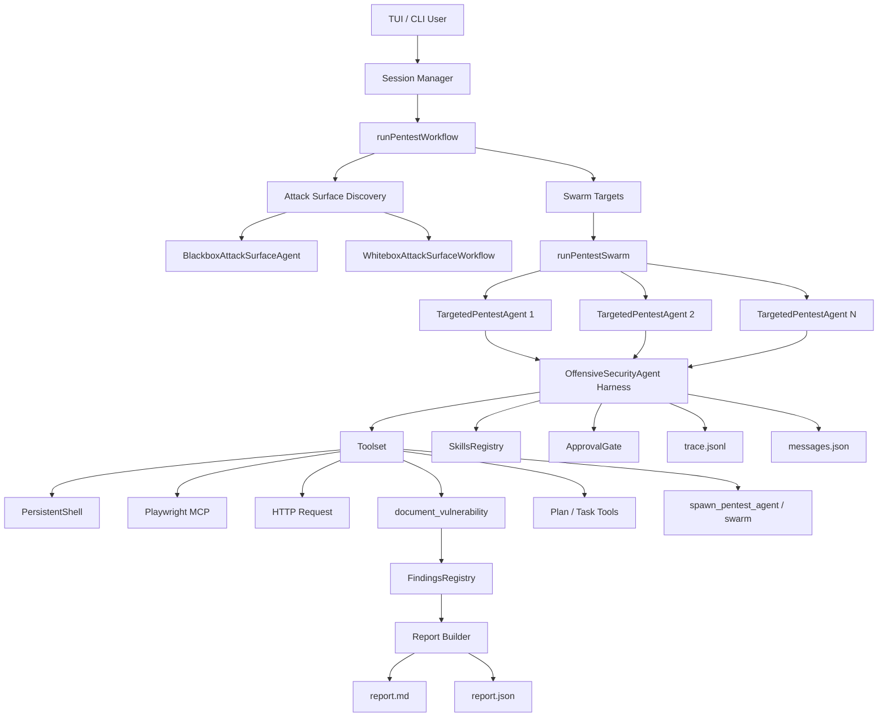
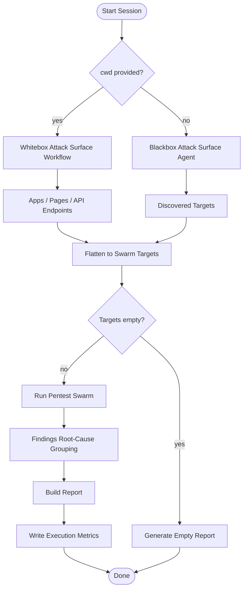
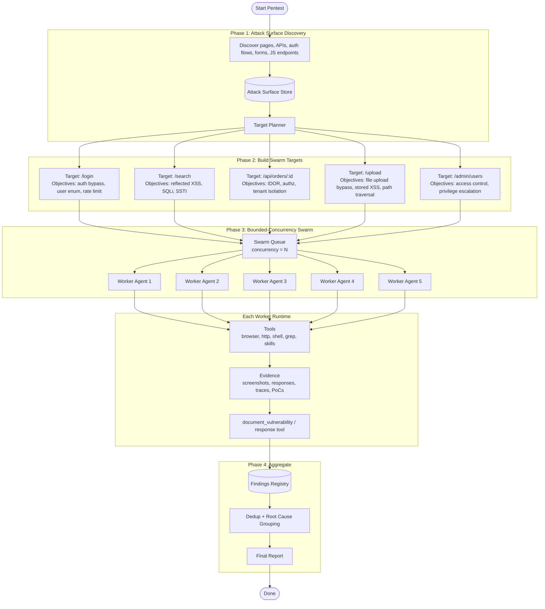
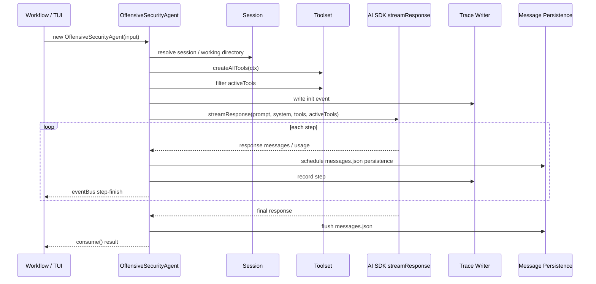
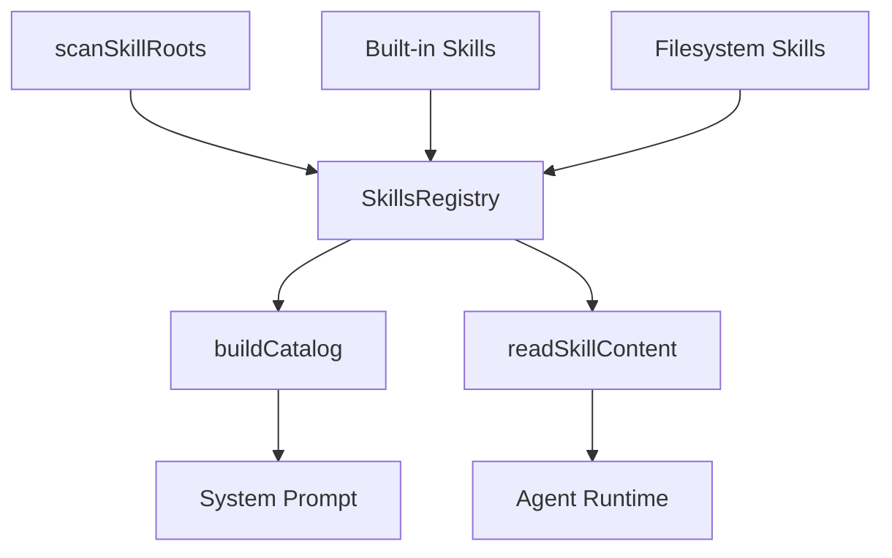
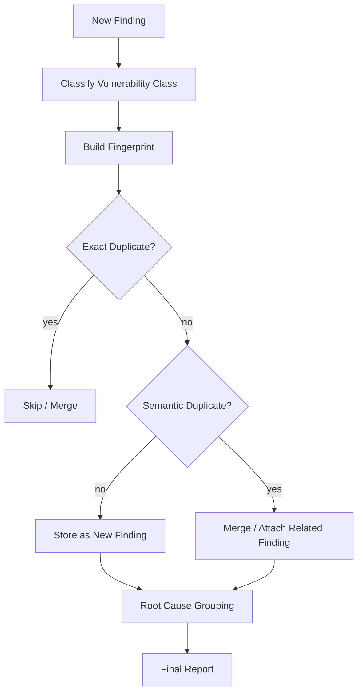

# Apex Architecture

本文档只描述 `backend-agent/tests/apex` 的架构、执行流程和核心设计，不包含主项目对比内容。

## 1. 项目定位

Pensar Apex 是一个面向渗透测试的 AI agent 产品内核，偏向本地 TUI / CLI 场景。

它的核心目标不是固定漏洞分类流水线，而是：

- 先发现攻击面
- 再按攻击面拆分任务
- 最后让多个专门 worker 并发测试

这就是 attack-surface-driven swarm。

---

## 2. 核心目录

```text
tests/apex/src/core/
  workflows/
    pentest.ts
    whiteboxAttackSurface.ts
    threatModel.ts
  agents/
    offSecAgent/
      offensiveSecurityAgent.ts
      tools/
      prompt.ts
      trace.ts
      types.ts
    specialized/
      pentest/agent.ts
      attackSurface/blackboxAgent.ts
  skills/
    registry.ts
    scanner.ts
    parser.ts
    builtins/
  findings/
    registry.ts
  session/
    index.ts
    persistence.ts
    loader.ts
    execution-metrics.ts
  operator/
    approvalGate.ts
    types.ts
  report/
    builder.ts
    renderers/
  ai/
    ai.ts
```

---

## 3. 总体架构图



---

## 4. 主流程

### 4.1 Pentest Workflow

`tests/apex/src/core/workflows/pentest.ts` 是 Apex 的主调度入口。



### 4.2 关键步骤

1. 先做攻击面发现。
2. 将发现结果扁平化为 swarm targets。
3. 按 target 并发启动 worker agent。
4. 聚合 findings，做去重和根因分组。
5. 输出报告与执行指标。

---

## 5. Attack-Surface-Driven Swarm

这是 Apex 的核心设计。

它不是按漏洞类型拆 agent，而是按攻击面目标拆 agent。

例如：

```text
/login
/search
/api/orders/:id
/upload
/admin/users
```

每个目标对应一个 worker agent，并携带目标专属 objectives。



---

## 6. OffensiveSecurityAgent Harness

`tests/apex/src/core/agents/offSecAgent/offensiveSecurityAgent.ts` 是 Apex 的通用 agent runtime。

它负责：

- 构建 toolset
- 过滤 active tools
- 维护 persistent shell
- 管理 Playwright MCP browser session
- 写 trace.jsonl
- 持久化 messages.json
- 支持 approval gate
- 支持 structured response tool

### 6.1 执行时序图



### 6.2 关键能力

```text
streaming
persistent shell
browser session
approval gate
skills catalog
tool filtering
trace logging
message persistence
structured response
cache metrics
```

---

## 7. 工具体系

`createAllTools(ctx)` 提供完整工具集。

### 7.1 工具分类

```text
Browser
  - createBrowserToolset
  - Playwright MCP session

Core pentest
  - execute_command
  - http_request
  - document_vulnerability

Filesystem/search
  - read_file
  - list_files
  - grep
  - create_file
  - update_file

Attack surface
  - document_app
  - document_endpoint
  - extract_js_endpoints
  - crawl_authenticated_area
  - test_endpoint_variations
  - validate_discovery_completeness
  - create_attack_surface_report

Authentication
  - authenticate_session
  - delegate_to_auth_subagent
  - complete_authentication
  - detect_auth_scheme
  - probe_auth_endpoints

Planning/tasks
  - write_plan
  - submit_plan
  - create_task
  - update_task
  - list_tasks

Skills/memory
  - read_skill
  - add_memory
  - get_memory
  - list_memories

Orchestration
  - spawn_pentest_agent
  - spawn_pentest_swarm
  - run_pentest_workflow
  - run_attack_surface

Observability
  - checkpoint_state
```

### 7.2 工具面优势

- 工具覆盖比固定 shell/browser 更广。
- 更贴近真实渗透测试工作流。
- 允许计划、任务、证据、发现、回溯一体化。

---

## 8. Skills 体系

`tests/apex/src/core/skills/registry.ts` 提供显式 SkillsRegistry。



### 8.1 特点

- built-in skills 和 filesystem skills 统一管理
- 支持 catalog 构建
- 支持按需加载完整技能内容
- 比“仅在 prompt 中提示有 skills”更可靠

---

## 9. Findings 流程

`tests/apex/src/core/findings/registry.ts` 管理结果去重和归类。

### 9.1 核心职责

- vulnerability class 提取
- endpoint normalization
- exact dedup
- application-wide dedup
- semantic dedup
- root-cause grouping

### 9.2 流程图



---

## 10. 适用场景

### 10.1 Apex 更适合

- 本地 TUI / CLI 渗透测试交互
- 需要强 agent 自主能力
- 需要 plan / execute 分离
- 需要多 worker swarm
- 需要显式 skills / findings / operator gate

### 10.2 Apex 的限制

- 更偏本地 session 模式
- 不像主项目那样天然服务化
- 与 Postgres/S3/Dashboard 的集成弱一些
- 架构复杂度更高

---

## 11. 一句话总结

Apex 本质上是：

```text
一个以攻击面为中心、以 worker swarm 为执行模型、以 skills/approval/findings 为支撑的渗透测试 agent 产品内核。
```

它比固定漏洞 pipeline 更适合真实渗透测试场景，但也更复杂。
