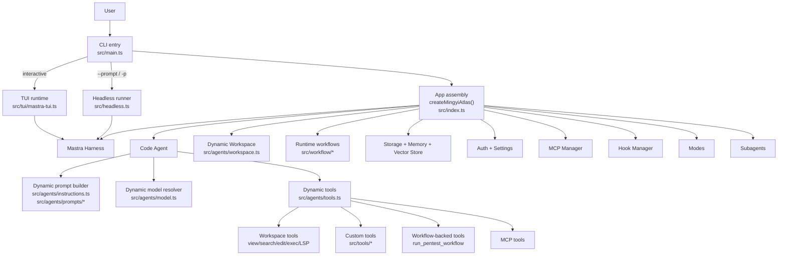
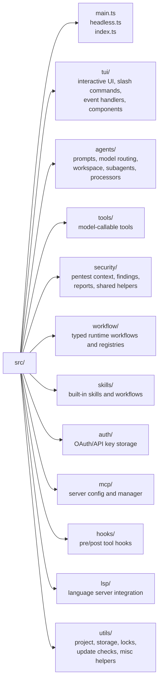
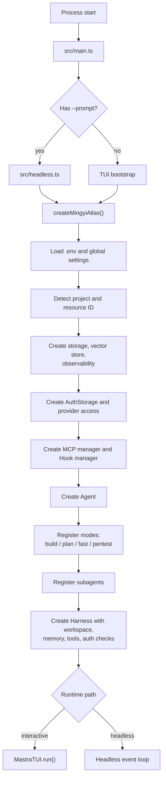
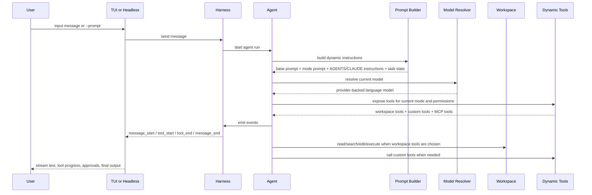
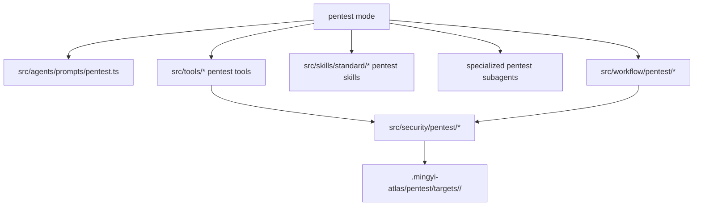

# Architecture Overview

Mingyi Atlas is a terminal AI agent built on top of Mastra's `Agent`, `Harness`, and `Workspace` primitives. The project combines an interactive TUI, a headless runner, dynamic prompts, dynamic tools, skill loading, runtime workflows, persistent state, and a pentest-oriented security domain layer.

This document focuses on three questions:

1. What lives where in the repository.
2. How the app is assembled at startup.
3. How one user request moves through prompts, models, tools, and UI.

## Top-Level Runtime Map



## Source Layout



## Directory Responsibilities

```text
src/
  main.ts                 CLI entry for interactive mode
  headless.ts             CLI entry for non-interactive runs
  index.ts                createMingyiAtlas() composition root
  schema.ts               Harness state schema

  tui/                    Terminal UI, slash commands, event rendering
  agents/                 Prompt assembly, model routing, workspace, subagents
  tools/                  Agent-callable tool implementations
  security/               Pentest domain logic and runtime artifact helpers
  workflow/               Typed runtime workflows and registries
  skills/                 Built-in Markdown skills and workflows
  auth/                   Credential storage and provider auth helpers
  mcp/                    MCP config loading and tool exposure
  hooks/                  PreToolUse/PostToolUse hook system
  lsp/                    LSP support for workspace tools
  utils/                  Shared project/runtime utilities
```

## Startup and Assembly Flow

The composition root is `createMingyiAtlas()` in `src/index.ts`. Both the TUI path and the headless path use it.



## Request Execution Flow

This is the core flow for one interactive message or one headless prompt.



## Prompt, Mode, and Tool Interaction

Modes change three things together:

- Prompt behavior in `src/agents/prompts/*`
- Default model selection in `src/index.ts`
- Tool exposure in `src/agents/tools.ts`

Current modes:

- `build`: default software engineering mode
- `plan`: planning-oriented mode with write tools disabled at the workspace layer
- `fast`: lightweight and cheaper/faster mode
- `pentest`: security-assessment mode with pentest prompt, pentest tools, and built-in pentest skills

The prompt builder in `src/agents/prompts/index.ts` combines:

- Base prompt from `src/agents/prompts/base.ts`
- Mode-specific prompt
- Model-specific prompt overrides
- Current task list from harness state
- Instructions loaded from project or global `AGENTS.md` and `CLAUDE.md`

## Workspace and Tool Layers

There are two tool layers in the system.

1. Workspace tools from Mastra:
   `view`, `find_files`, `search_content`, `write_file`, `string_replace_lsp`, `execute_command`, and related LSP/process tools.
2. Custom dynamic tools in `src/tools/`:
   security analysis, browser/container helpers, reporting, scope recording, and similar domain-specific operations.

Some custom tools are thin wrappers over runtime workflows. `run_pentest_workflow` is the current example: it exposes a workflow-backed execution path through the pentest tool surface.

The workspace is built in `src/agents/workspace.ts` and controls:

- project root
- additional allowed paths
- sandbox environment
- skill directories
- LSP configuration
- plan-mode tool restrictions

Dynamic tool registration in `src/agents/tools.ts` controls:

- always-on tools
- mode-specific tools
- MCP-injected tools
- disabled tools from config
- per-tool deny rules from thread state
- hook wrapping for pre/post tool use

## Skills, Workflows, and Subagents

Skills are Markdown operating instructions, not TypeScript tools. Runtime workflows are TypeScript graphs and state machines.

- Skills describe how to think and what order to follow.
- Runtime workflows describe what executes and what state is persisted.
- A workflow skill may guide a multi-step process without being executable code.
- A runtime workflow may be executable code without being the primary orchestration prompt.

- Skill path resolution lives in `src/agents/workspace.ts`
- Built-in skills live in `src/skills`
- Pentest built-in skills are only added to skill paths in `pentest` mode

Default subagents include:

- `explore`
- `plan`
- `execute`
- `attack-surface`
- `auth`
- `validation`
- `finding-judge`

The parent agent remains the orchestrator. Subagents are focused workers, not the final source of truth.

## Pentest Overlay

The pentest path adds domain-specific state, tools, prompts, and runtime artifacts on top of the normal agent runtime.
Today, the interactive pentest prompt remains the primary orchestrator; the runtime pentest workflow is an optional structured execution path.



Runtime pentest data is stored under:

```text
.mingyi-atlas/pentest/targets/<target-slug>/
  context.json
  findings.json
  workflow-runs/
  http-responses/
  browser-runs/
  tool-runs/
  reports/
```

This data should not be committed unless it is a sanitized fixture.

## Practical Entry Points for Contributors

If you want to understand or change a specific area, start here:

- Startup and composition: `src/main.ts`, `src/headless.ts`, `src/index.ts`
- Prompt behavior: `src/agents/instructions.ts`, `src/agents/prompts/*`
- Model routing: `src/agents/model.ts`
- Workspace behavior: `src/agents/workspace.ts`
- Tool exposure: `src/agents/tools.ts`
- Tool implementation: `src/tools/*`
- Runtime workflows: `src/workflow/pentest/*`
- TUI event flow: `src/tui/mastra-tui.ts`, `src/tui/event-dispatch.ts`, `src/tui/command-dispatch.ts`
- Pentest domain state: `src/security/pentest/*`
